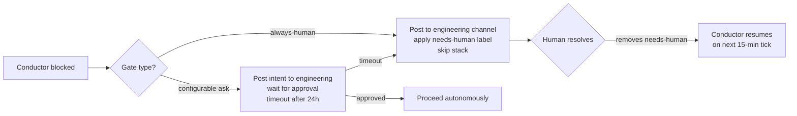

# Autonomous Pipeline — Human Interaction Gates

> **Status:** Design phase. Tracked in [#611](https://github.com/geoffjay/agentd/issues/611).
> See [autonomous-pipeline.md](autonomous-pipeline.md) for the full architecture.

This document defines exactly where the autonomous pipeline pauses for human input. Three categories of gates exist: operations that are always human, gates that are configurable, and operations that are always autonomous.

---

## Gate Categories

### Always Human

These operations cannot be delegated to an agent under any configuration:

| Operation | Reason |
|---|---|
| `gs auth login` | Interactive OAuth flow — one-time per environment, requires browser |
| Production deployments | Risk threshold requires explicit human sign-off |
| Security-critical dependency changes | Flagged by the security-auditor; requires human judgment |
| Merge conflict resolution when conductor escalates | Requires understanding of intent, not just syntax |
| Adding new external service integrations | Architectural impact beyond a single issue |
| Removing or deprecating a public API | Downstream consumers may be affected |

When the conductor encounters an always-human situation it cannot proceed past, it:

1. Posts to the `engineering` channel with a description of what is blocked and why
2. Applies the `needs-human` label to the relevant issue or PR
3. Skips all downstream work in the same stack
4. Resumes automatically once the `needs-human` label is removed

### Configurable Gates

These operations are **allowed by default** but can be overridden in individual agent YAML files via `tool_policies`. A project can tighten these gates without modifying agent logic.

| Gate | Default | Config Key | Effect when `ask` |
|---|---|---|---|
| PR auto-merge | `allow` | `conductor.auto_merge` | Conductor posts intent to engineering and waits for a reaction before merging |
| Issue auto-close after PR merge | `allow` | `conductor.auto_close_issues` | Conductor leaves issue open; human closes manually |
| Planner creating issues autonomously | `allow` | `planner.autonomous_creation` | Planner posts proposed issue list to engineering for review |
| New Cargo dependency additions | `ask` | `worker.new_dependencies` | Worker pauses and asks via `agent ask` before adding to `Cargo.toml` |
| Bulk file deletion | `ask` | `worker.bulk_delete` | Worker pauses and asks before deleting multiple files |

#### Configuring a Gate

Gates are expressed as `tool_policies` in agent YAML files. The orchestrator enforces them at dispatch time.

```yaml
# .agentd/agents/conductor.yml (excerpt)
tool_policies:
  - pattern: "gh pr merge *"
    policy: allow          # default: autonomous merge
  - pattern: "gh issue close *"
    policy: allow          # default: auto-close after merge

# To require human approval for merges, change to:
  - pattern: "gh pr merge *"
    policy: ask
```

```yaml
# .agentd/agents/worker.yml (excerpt)
tool_policies:
  - pattern: "cargo add *"
    policy: ask            # always ask before adding new dependencies
  - pattern: "rm -rf *"
    policy: deny           # never bulk-delete
```

!!! note "Policy DSL"
    See the [tool policies documentation](../public/tool-policies.md) for the full policy DSL reference including wildcard patterns, environment-specific overrides, and the `deny` policy.

### Always Autonomous

These operations never require human approval, regardless of configuration:

- Branch creation, deletion, and navigation via git-spice
- PR submission and force-push after restack
- Code review comments and approval
- Test writing and test file updates
- Documentation writing and updates
- Memory read and write operations (`agent memory remember/search`)
- Posting messages to communication channels
- Reading GitHub issues, PRs, and repository files
- Applying and removing labels (except `needs-human`)
- Closing issues that are direct results of a completed PR

---

## Escalation Path

When the conductor cannot proceed:



### Engineering Channel Escalation Format

The conductor uses a consistent format when escalating to the `engineering` channel:

```
🚨 Human action needed — [brief description]

Issue/PR: #<N> <title>
Blocked by: <reason>
What to do: <specific instruction>

After resolving, remove the `needs-human` label from #<N> to resume the pipeline.
```

---

## CLAUDE.md Reference

The always-human list must also appear in `CLAUDE.md` so that any agent operating outside a formal workflow respects these boundaries:

```markdown
## Human-Only Operations

The following must never be performed autonomously — always ask or escalate:

- gs auth login (interactive OAuth)
- Deploying to production environments
- Adding new external service integrations
- Resolving git merge conflicts that the conductor has escalated
- Removing or deprecating a public API surface
```

---

## Related Issues

| Issue | Title |
|---|---|
| [#611](https://github.com/geoffjay/agentd/issues/611) | Define human interaction gates and tool policies |
| [#642](https://github.com/geoffjay/agentd/issues/642) | Add agent file-path scoping |
| [#643](https://github.com/geoffjay/agentd/issues/643) | Define and enforce human approval gates |
| [#603](https://github.com/geoffjay/agentd/issues/603) | Create conductor agent YAML (implements escalation) |
