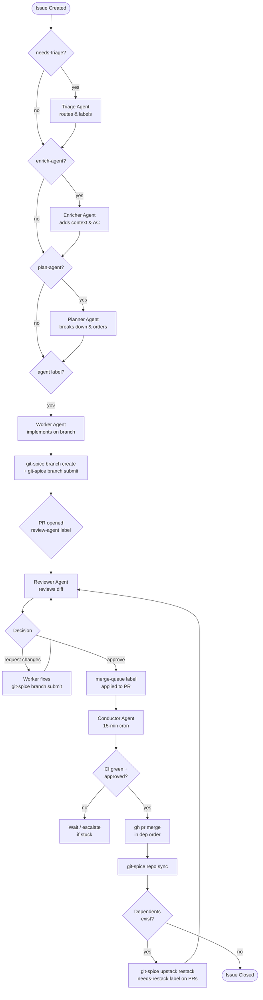
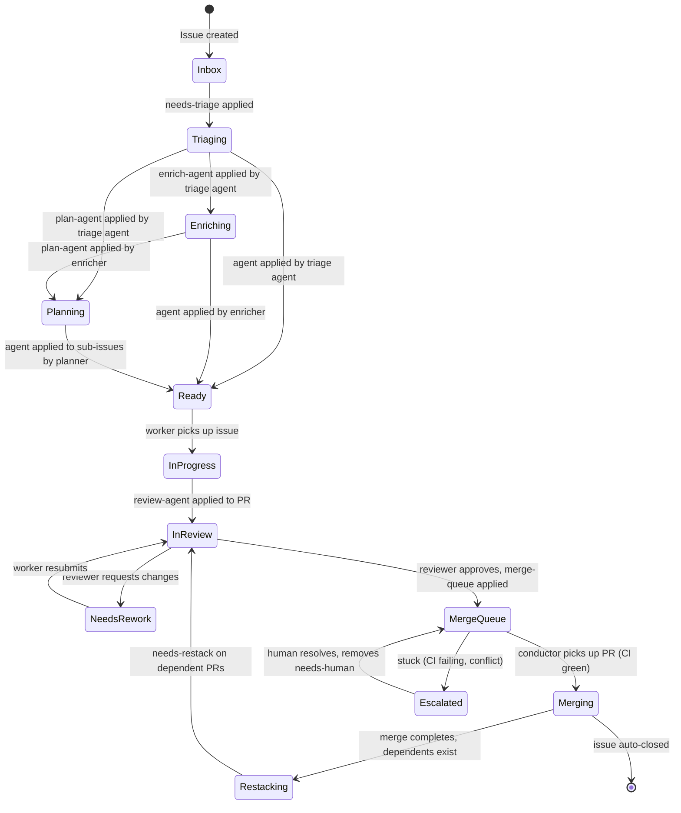

# Autonomous Development Pipeline — Architecture

> **Status:** Design phase. Implementation tracked in [v0.10.0 milestone](https://github.com/geoffjay/agentd/milestone/20) and [v0.9.0 milestone](https://github.com/geoffjay/agentd/milestone/18).
>
> This document captures design decisions. Update it as implementation diverges from the design.

---

## Vision

A complete software development lifecycle running with minimal human interaction:

```
Issue Created → Enriched → Planned → Implemented → Reviewed → Merged → Restacked
```

Human interaction is reduced to: one-time environment setup, configurable approval gates, and conflict escalation handling. The goal is a proof-of-concept demonstrating agentd as a complete autonomous development platform.

---

## Pipeline Stages



### Stage 1 — Triage

**Trigger:** `needs-triage` label applied to an issue
**Agent:** triage
**Workflow:** `triage-worker.yml`

The triage agent reads the issue and applies appropriate routing labels (`agent`, `plan-agent`, `enrich-agent`, `docs-agent`, etc.), estimates complexity, and optionally adds `enrich-agent` if the issue lacks sufficient detail. Issues that are clearly out of scope or duplicates are commented on and closed.

### Stage 2 — Enrich

**Trigger:** `enrich-agent` label
**Agent:** enricher
**Workflow:** `enricher-worker.yml`

The enricher agent expands sparse issues into actionable work items. It adds:
- Acceptance criteria as a checklist
- Technical context (relevant files, dependencies, patterns)
- Complexity estimate (S / M / L / XL)
- Suggested labels for downstream routing

After enrichment the issue is ready for implementation or planning.

### Stage 3 — Plan

**Trigger:** `plan-agent` label
**Agent:** planner
**Workflow:** `plan-worker.yml`

The planner handles epics and complex issues. It:
- Breaks the parent issue into sub-issues
- Creates GitHub sub-issue relationships via the API
- Adds `blocked-by` relationships to encode implementation order
- Applies the `agent` label to leaf issues (ready to implement)
- Determines the stack base: the planner uses existing `blocked-by` relationships to establish which issues must land first, creating a linear or tree-shaped stack

### Stage 4 — Implement

**Trigger:** `agent` label on an issue
**Agent:** worker
**Workflow:** `issue-worker.yml`

The worker agent implements the issue on a stacked branch:

```bash
# Determine stack base from blocked-by relationships
# If issue is blocked by #123, base the branch on #123's branch
gs branch create issue-<N> --base <blocking-branch-or-main>

# Implement the change, then submit
gs branch submit --fill
```

After pushing the PR, the worker applies the `review-agent` label to trigger the reviewer.

### Stage 5 — Review

**Trigger:** `review-agent` label on a PR
**Agent:** reviewer
**Workflow:** `pull-request-reviewer.yml`

The reviewer fetches the diff, evaluates correctness, safety, and consistency, then either approves or requests changes. On approval it:
1. Removes the `review-agent` label
2. Applies the `merge-queue` label to hand off to the conductor

### Stage 6 — Merge

**Trigger:** `merge-queue` label on a PR (scanned by conductor's cron)
**Agent:** conductor
**Workflow:** `conductor-sync.yml`

The conductor runs every 15 minutes and:
1. Collects all PRs with `merge-queue` label
2. Sorts them by dependency order (deepest/blocking branches first)
3. Checks each PR: CI must be green and at least one approval
4. Merges eligible PRs in order: `gh pr merge <N> --squash --repo geoffjay/agentd`
5. After each merge: `gs repo sync` to update git-spice state
6. Restacks dependent branches: `gs upstack restack`
7. Applies `needs-restack` to any PRs whose base has changed
8. Escalates unresolvable conflicts to the engineering channel

### Stage 7 — Restack

**Trigger:** `needs-restack` label on a PR or post-merge restack by conductor
**Agent:** conductor (automated) or worker (if changes needed)

After a merge, the conductor calls `gs upstack restack` to rebase all branches that stacked on the merged branch. If a rebase has conflicts the conductor cannot resolve, it:
1. Posts to the `engineering` channel with the conflict details
2. Applies a `needs-human` label (a configurable gate — see [Human Interaction Gates](autonomous-pipeline-gates.md))
3. Waits for human resolution before continuing the queue

---

## Agent Roster

| Agent | Label Trigger | Scope | Room Membership |
|---|---|---|---|
| **triage** | `needs-triage` (issue) | Routes and labels incoming issues | engineering, announcements (observer) |
| **enricher** | `enrich-agent` (issue) | Adds AC, context, complexity to issues | engineering, announcements (observer) |
| **planner** | `plan-agent` (issue) | Breaks down epics, sets `blocked-by` order | engineering, announcements (observer) |
| **worker** | `agent` (issue) | Implements on stacked git-spice branches | engineering, announcements (observer) |
| **reviewer** | `review-agent` (PR) | Reviews diffs, approves or requests changes | engineering, announcements (observer) |
| **conductor** | cron every 15 min | Manages merge queue, restacks, escalates | engineering, announcements (observer) |
| **documenter** | `docs-agent` (issue) | Writes and updates documentation | engineering, announcements (observer) |
| **architect** | `architecture` (issue) | ADRs, design review, architectural changes | engineering, announcements (observer) |
| **security-auditor** | `security-agent` (issue) | Security audits and vulnerability review | engineering, announcements (observer) |
| **tester** | `test-agent` (issue) | Test coverage for undertested areas | engineering, announcements (observer) |
| **refactor** | `refactor-agent` (issue) | Code quality and refactoring | engineering, announcements (observer) |
| **researcher** | `research-agent` (issue) | Technical research and investigation | engineering, announcements (observer) |
| **release-manager** | `release` (issue) | Release preparation and changelog | engineering, announcements (observer) |

---

## Label-Driven State Machine

Issues and PRs move through the pipeline via GitHub labels. The orchestrator's workflow engine polls for labelled items and dispatches them to the appropriate agent.



### Labels Reference

| Label | Applied To | Applied By | Triggers |
|---|---|---|---|
| `needs-triage` | Issue | Human or any agent | triage-worker workflow |
| `enrich-agent` | Issue | Triage agent | enricher-worker workflow |
| `plan-agent` | Issue | Triage or enricher | plan-worker workflow |
| `agent` | Issue | Triage, enricher, or planner | issue-worker workflow |
| `review-agent` | PR | Worker agent | pull-request-reviewer workflow |
| `merge-queue` | PR | Reviewer agent | Conductor's cron scan |
| `needs-restack` | PR | Conductor | Worker or conductor restack |
| `needs-human` | PR or Issue | Conductor | Human notification in engineering channel |
| `docs-agent` | Issue | Any agent or human | docs-worker workflow |
| `architecture` | Issue | Any agent or human | architect workflow |
| `security-agent` | Issue | Any agent or human | security-audit workflow |

---

## git-spice Integration

### Why Stacked Branches

The autonomous pipeline implements work in dependency order. When issue B is blocked by issue A, the worker implementing B must build on A's branch — not main. git-spice manages this stacked branch graph, ensures PRs target the right base, and restacks all dependents after a merge without manual rebasing.

### git-spice State

git-spice stores its state in `refs/spice/data` within the repository. This is a lightweight JSON blob tracking the branch stack relationships. It is safe to push alongside regular commits.

### One-Time Setup (human required)

```bash
# Authenticate with GitHub (interactive OAuth — cannot be automated)
gs auth login

# Initialize git-spice in the repository
gs repo init
```

After `gs repo init`, commit the resulting `.git/config` changes and push. See [#602](https://github.com/geoffjay/agentd/issues/602).

### Commands by Agent Role

=== "Worker"

    ```bash
    # Create a new branch stacked on the blocking issue's branch
    # If issue #42 is blocked by #38, and #38's branch is issue-38:
    gs branch create issue-42 --base issue-38

    # If not blocked by anything, stack on main:
    gs branch create issue-42

    # After committing work, create/update the PR:
    gs branch submit --fill
    # --fill uses the branch name and top commit message to fill PR title/body

    # If reviewer requests changes, amend and resubmit:
    git add -p && git commit --amend --no-edit
    gs branch submit
    ```

=== "Reviewer"

    ```bash
    # Understand the stack context before reviewing
    gs log short

    # The reviewer does not need to run git-spice commands —
    # it reviews the PR diff via gh pr diff <N> as normal.
    # Stack context is visible in the PR description generated by gs branch submit.
    ```

=== "Conductor"

    ```bash
    # After merging a PR (run once per merge):
    gs repo sync
    # Syncs git-spice state: marks merged branches as landed,
    # updates dependent branch bases.

    # Restack all branches that depended on the merged branch:
    gs upstack restack --branch <merged-branch>
    # This rebases dependent branches onto the updated base.

    # Force-push restacked branches (safe: preserves history intent):
    gs branch submit --force
    ```

=== "Planner"

    ```bash
    # View current stack to understand what's in flight
    gs log

    # The planner uses blocked-by issue relationships to determine
    # stack ordering. It does not manipulate git-spice directly.
    # Stack structure follows from the blocked-by graph on issues.
    ```

### Stack Dependency Model

The mapping from issue dependencies to branch stacks:

```
Issue graph (blocked-by):          Branch stack:
  #42 blocked by #38                 main
  #43 blocked by #38                   └── issue-38   (PR #101)
  #44 blocked by #43                         ├── issue-42  (PR #102)
                                             └── issue-43  (PR #103)
                                                   └── issue-44  (PR #104)
```

The conductor merges in this order: `#101 → #102 → #103 → #104`. After merging `#101`, it runs `gs repo sync` and `gs upstack restack`, which rebases `issue-42`, `issue-43`, and `issue-44` onto the updated main.

---

## Conductor Behavior

The conductor is the pipeline's air-traffic controller. It runs as a scheduled workflow (`conductor-sync.yml`) every 15 minutes.

### Cron Cycle

```
Every 15 minutes:
  1. gs repo sync                          # refresh git-spice state
  2. Fetch all PRs with merge-queue label
  3. Sort by dependency order (deepest-in-stack first)
  4. For each PR in order:
       a. Check: CI passing? At least one approval?
       b. If yes: gh pr merge <N> --squash
                  gs repo sync
                  gs upstack restack --branch <merged>
                  gs branch submit --force  (force-push restacked branches)
                  gh issue close <issue-N>  (if conductor.auto_close_issues = allow)
       c. If CI failing: skip, note in status digest
       d. If conflict: post to engineering channel, apply needs-human label
  5. Post status digest to announcements channel
```

### Merge Queue Ordering

The conductor sorts the `merge-queue` PRs using the git-spice stack depth: branches closer to main merge first. Ties are broken by PR creation time (oldest first).

### Conflict Escalation

When `gs upstack restack` encounters a merge conflict:

1. Conductor records the conflict details (files, branches involved)
2. Posts to `engineering` channel:
   ```
   ⚠️ Restack conflict: issue-44 cannot rebase onto issue-43 after merge.
   Conflict in: src/orchestrator/mod.rs
   Human action needed: resolve conflict and run `gs branch submit --force` on issue-44.
   ```
3. Applies `needs-human` label to the affected PR
4. Skips all downstream branches in this stack (they depend on the conflicted branch)
5. Continues processing independent stacks

### Status Digest

After each cron cycle, the conductor posts a digest to the `announcements` channel:

```
🔄 Pipeline digest (15:00 UTC)
Merged: #102 (issue-42), #103 (issue-43)
Waiting CI: #105 (issue-46)
Needs human: #104 (issue-44) — restack conflict
Queue depth: 3 PRs
```

---

## Workflow Chaining

The pipeline uses label application as the inter-workflow communication mechanism. When an agent completes its stage, it applies the next stage's label, which the orchestrator's poller picks up within `poll_interval` seconds.

```
Worker completes → applies review-agent label to PR
→ pull-request-reviewer workflow fires within 60 s
→ Reviewer approves → applies merge-queue label to PR
→ Conductor picks it up on next 15-min tick
```

There is no direct workflow-to-workflow call. The label graph is the message bus.

### Future: `dispatch_result` Trigger

Issue [#641](https://github.com/geoffjay/agentd/issues/641) proposes a `dispatch_result` trigger type that fires when a specific workflow completes with a given result. This would enable lower-latency chaining without the 15-minute conductor tick. Until #641 is implemented, all chaining goes through labels.

---

## Human Interaction Gates

See [autonomous-pipeline-gates.md](autonomous-pipeline-gates.md) for the full gate reference.

Summary:

| Category | Examples |
|---|---|
| **Always human** | `gs auth login`, production deploys, conflict resolution |
| **Configurable** | PR auto-merge, issue auto-close, new Cargo dependencies |
| **Always autonomous** | Branch ops, PR submission, code review, docs, tests |

---

## Known Limitations and Open Questions

### Limitations (at design phase)

- **Single repository**: The pipeline assumes all work is in `geoffjay/agentd`. Cross-repo stacks are not supported by this design.
- **Linear merge queue**: The conductor processes one stack at a time. Parallel independent stacks are supported but the 15-minute tick is shared.
- **No rollback**: The pipeline has no automated rollback if a merged PR breaks main. A human must revert.
- **git-spice auth is one-time-per-machine**: Cloud agents running in fresh containers need a persistent credential store or a service account token.

### Open Questions

- **Stack discovery**: How does the worker know which branch to base on when `blocked-by` issues may not yet have a branch? Proposal: worker checks if the blocking issue's PR exists; if not, it waits and comments on the issue.
- **Conductor identity**: Should the conductor merge under its own GitHub token or a shared bot token? Affects audit trail.
- **PR target validation**: git-spice sets the PR base automatically. If a blocking branch is force-pushed after restack, GitHub may show the PR as targeting an outdated commit. Does `gs repo sync` handle this?
- **Parallel workers on the same stack**: If two workers both branch off `issue-38` simultaneously, who wins? The second `gs branch create` will succeed, but `gs upstack restack` may produce conflicts.

---

## Related Issues

| Issue | Title |
|---|---|
| [#597](https://github.com/geoffjay/agentd/issues/597) | Epic: git-spice integration |
| [#598](https://github.com/geoffjay/agentd/issues/598) | Epic: Conductor agent |
| [#599](https://github.com/geoffjay/agentd/issues/599) | Epic: Agent template updates |
| [#601](https://github.com/geoffjay/agentd/issues/601) | Create git-spice skill |
| [#602](https://github.com/geoffjay/agentd/issues/602) | Initialize git-spice in repository |
| [#603](https://github.com/geoffjay/agentd/issues/603) | Create conductor agent YAML |
| [#604](https://github.com/geoffjay/agentd/issues/604) | Create conductor-sync workflow |
| [#610](https://github.com/geoffjay/agentd/issues/610) | Create pipeline labels |
| [#611](https://github.com/geoffjay/agentd/issues/611) | Define human interaction gates |
| [#612](https://github.com/geoffjay/agentd/issues/612) | Document autonomous pipeline |
| [#613](https://github.com/geoffjay/agentd/issues/613) | End-to-end PoC validation |
| [#641](https://github.com/geoffjay/agentd/issues/641) | Add `dispatch_result` trigger type |
