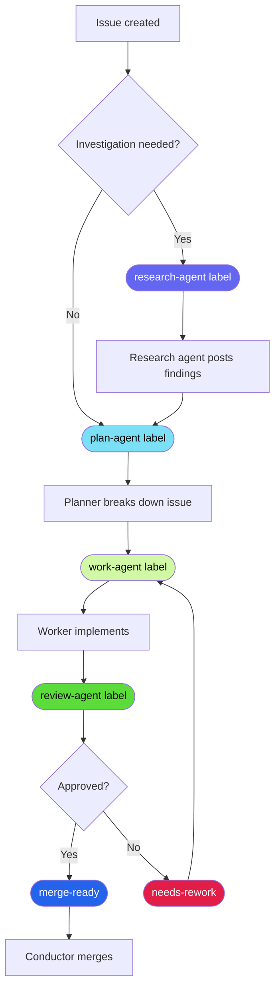

# Research Agent

The research agent investigates topics before implementation begins — crate ecosystems,
external protocols, architectural patterns, feasibility questions, and library tradeoffs.
It posts structured findings as a GitHub issue comment and optionally commits a planning
document to `docs/planning/`.

## Trigger

Add the `research-agent` label to any open issue.

```bash
gh issue edit <number> --repo geoffjay/agentd --add-label "research-agent"
```

The research-worker workflow polls for this label every 60 seconds. Once the agent
finishes, it removes the label automatically.

!!! note "Label color"
    `research-agent` is indigo (`#6366f1`) — a specialist dispatch label, distinct
    from the green implementation-agent labels.

## When to use it

Use the research agent when an issue involves:

- An unfamiliar crate or library ecosystem (e.g. "should we use `sqlx` or `sea-orm`?")
- An external protocol or specification that needs reading before design
- An architectural decision where tradeoffs are not yet understood
- A feasibility question (e.g. "can we embed X in our async runtime?")
- Prior art investigation before writing a design document

**Skip the research agent** when the technology is already well-understood, the
implementation path is clear, or the issue is purely a bug fix or refactor. Unnecessary
research dispatch adds latency without benefit.

## Pipeline position

Research is an optional early step — it feeds findings into planning before implementation
starts.



## What the agent does

1. **Searches shared memory** for any prior research on the same topic, building on
   existing findings rather than re-investigating from scratch.
2. **Reads the issue body** to understand the research question, scope, and expected
   deliverables.
3. **Investigates the topic** in priority order:
    - Shared memory and existing documentation in `docs/`
    - Relevant source files in `crates/`
    - External references (official docs, RFCs, crate documentation)
4. **Posts structured findings** as a GitHub issue comment (see [Output format](#output-format)).
5. **Optionally commits a planning document** to `docs/planning/<topic>.md` when the
   findings are detailed enough to warrant a persistent reference.
6. **Stores key discoveries** in shared memory so other agents can build on them.
7. **Announces completion** in the `#engineering` room.
8. **Removes the `research-agent` label** to signal that dispatch is complete.

## Output format

The agent posts findings using this structure:

```markdown
## Research Findings: <topic>

### Summary
<1–3 sentence executive summary of what was found>

### Findings
<detailed findings, organized by subtopic>

### Recommendations
<actionable next steps or design recommendations>

### Open Questions
<questions that still require investigation or a human decision>

### References
<links, file paths, crate names, or prior art consulted>
```

!!! tip "Reading findings"
    The **Summary** section is the fastest read — check it first to decide whether
    the full findings are relevant to what you're working on. **Recommendations**
    contains the actionable output that typically feeds directly into a planning or
    implementation issue.

## Planning documents

When research produces findings detailed enough to guide future work, the agent
creates a planning document at:

```
docs/planning/<topic>.md
```

These documents are committed on a stacked branch and submitted as a PR with the
`review-agent` label. They are archived in `docs/planning/` and cross-linked from
the issue comment.

## Shared memory

The research agent stores key findings in the shared memory service under its actor
identity `research`. Other agents — particularly the planner and worker — can
retrieve this context before starting related work:

```bash
# Search for prior research on a topic
agent memory search "<topic>" --as-actor research --limit 5 --json
```

## Related

- [Pipeline State Machine](../pipeline-state-machine.md) — full label reference and lifecycle diagram
- [Templates](../templates.md) — how to write issue descriptions that guide research effectively
- `docs/planning/` — archived research planning documents
- `.agentd/workflows/research-worker.yml` — workflow definition that drives dispatch
