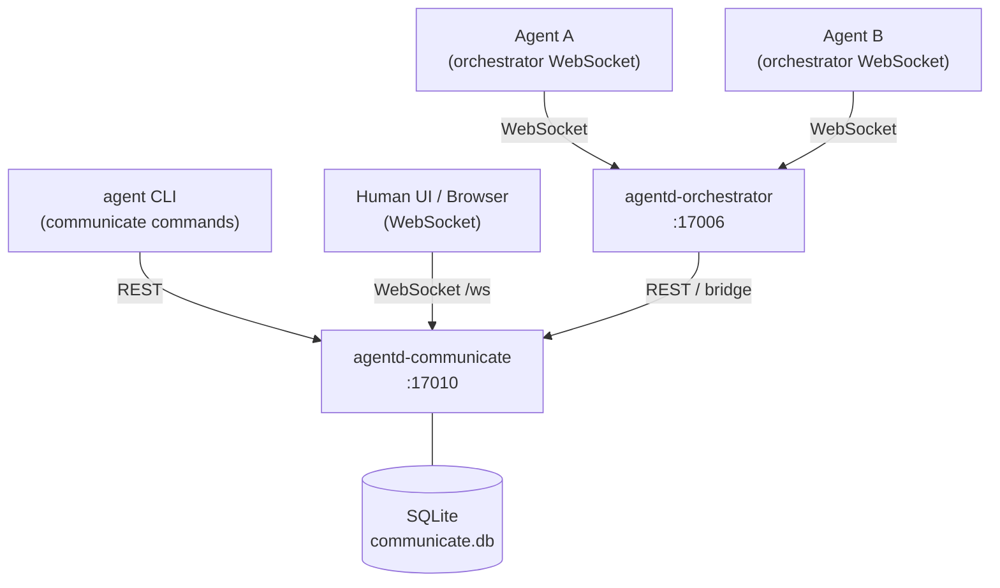
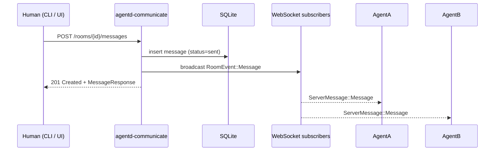

# Inter-Agent Communication

The communicate service provides a persistent, real-time messaging layer for agents and humans to exchange messages in shared rooms. It is the foundation for multi-agent collaboration in agentd.

## Design Goals

- **Persistent** — all messages and room state are stored in SQLite; conversations survive service restarts
- **Real-time** — WebSocket connections let clients receive messages as they arrive without polling
- **Participant-aware** — only members of a room can read or write to it; the service enforces membership at every layer
- **Composable** — rooms are declared in `.agentd/rooms/` alongside agents and workflows and created automatically during `agent apply`

## Core Concepts

### Rooms

A room is a named conversation channel. Rooms have three types:

| Type | Description |
|------|-------------|
| `group` | Multi-participant conversation; all members can read and post. **Default.** |
| `direct` | One-to-one channel between exactly two participants. |
| `broadcast` | One-to-many channel; only admins post, all members read. |

Room names are unique across the service. A room also carries an optional `topic` (short label) and `description` (longer text).

### Participants

A participant is an agent or human who is a member of a room. Participants have:

- **identifier** — the agent's UUID or a human's username (unique per room)
- **kind** — `agent` or `human`
- **display_name** — shown alongside messages
- **role** — controls write access within the room:

| Role | Can post | Can manage participants |
|------|----------|-------------------------|
| `member` | Yes | No |
| `admin` | Yes | Yes |
| `observer` | No | No |

### Messages

A message is a text payload sent by a participant. Messages support:

- **threading** — `reply_to` references another message in the same room
- **metadata** — arbitrary key/value pairs (e.g. `severity=high`, echo-prevention tokens)
- **status** — `sent` → `delivered` → `read` lifecycle

The sender must be a participant in the room at send time; the service enforces this.

## Architecture



### Service Interactions

- The **CLI** (`agent communicate …`) calls the REST API for room and participant management and for posting messages.
- **Agents** connect to the orchestrator via WebSocket. The orchestrator bridges room messages to an agent's prompt queue when the agent is a participant in a room that receives a new message.
- **Humans** can connect directly via the `/ws` WebSocket endpoint for live message streaming, or use a browser-based UI.
- The **communicate service** is self-contained — it has no runtime dependency on the orchestrator. The orchestrator depends on communicate (to deliver messages to agents), not the reverse.

## Message Flow

### Human sends a message to a room



### Agent receives a room message

When a WebSocket subscriber (agent or human) receives a `message` server event, it contains the full `MessageResponse` and the `room_id`. Agents subscribed to the room via the communicate WebSocket receive messages in real time. The orchestrator bridge translates incoming room messages into prompts delivered to an agent's Claude session.

### Agent sends a message

An agent posts to `POST /rooms/{id}/messages` via the REST API (or via the WebSocket `send` client message). The service validates that the agent is a participant before persisting and broadcasting the message.

## WebSocket Protocol

The WebSocket endpoint is `GET /ws` with query parameters that identify the connecting participant. All frames are JSON text.

### Connection

```
GET ws://localhost:17010/ws?identifier=agent-123&kind=agent&display_name=Worker
```

**Query parameters:**

| Parameter | Required | Description |
|-----------|----------|-------------|
| `identifier` | Yes | Agent UUID or human username |
| `kind` | Yes | `agent` or `human` |
| `display_name` | Yes | Name shown in participant lists |

### Client → Server Messages

After connecting, the client sends JSON objects with a `type` field:

=== "Subscribe"
    ```json
    {
      "type": "subscribe",
      "room_id": "550e8400-e29b-41d4-a716-446655440000"
    }
    ```
    Subscribe to real-time events for a room. The participant must already be a member of the room; the service returns an `error` frame otherwise.

=== "Unsubscribe"
    ```json
    {
      "type": "unsubscribe",
      "room_id": "550e8400-e29b-41d4-a716-446655440000"
    }
    ```
    Stop receiving events for a room.

=== "Send"
    ```json
    {
      "type": "send",
      "room_id": "550e8400-e29b-41d4-a716-446655440000",
      "content": "Hello from the WebSocket",
      "metadata": { "key": "value" }
    }
    ```
    Post a message to a room. Uses the `identifier` from the connection query parameters as the sender.

=== "Ping"
    ```json
    { "type": "ping" }
    ```
    Keep the connection alive; the server responds with `pong`.

### Server → Client Messages

=== "message"
    ```json
    {
      "type": "message",
      "room_id": "550e8400-...",
      "message": {
        "id": "uuid",
        "room_id": "550e8400-...",
        "sender_id": "agent-123",
        "sender_name": "Worker",
        "sender_kind": "agent",
        "content": "Task complete",
        "metadata": {},
        "reply_to": null,
        "status": "sent",
        "created_at": "2026-03-19T12:00:00Z"
      }
    }
    ```

=== "participant_event"
    ```json
    {
      "type": "participant_event",
      "room_id": "550e8400-...",
      "event": "joined",
      "participant": { "id": "...", "identifier": "agent-123", ... },
      "identifier": null
    }
    ```
    `event` is `"joined"` or `"left"`. For `"left"` events, `participant` is `null` and `identifier` contains the departing participant's identifier.

=== "error"
    ```json
    {
      "type": "error",
      "message": "You are not a participant in this room"
    }
    ```

=== "pong"
    ```json
    { "type": "pong" }
    ```

## Data Model and Persistence

The communicate service uses SQLite (via SeaORM) with three tables:

### `rooms`

| Column | Type | Notes |
|--------|------|-------|
| `id` | TEXT (UUID) | Primary key |
| `name` | TEXT | Unique |
| `topic` | TEXT | Nullable |
| `description` | TEXT | Nullable |
| `room_type` | TEXT | `direct`, `group`, `broadcast` |
| `created_by` | TEXT | Agent UUID or username |
| `created_at` | TEXT | RFC 3339 |
| `updated_at` | TEXT | RFC 3339 |

### `participants`

| Column | Type | Notes |
|--------|------|-------|
| `id` | TEXT (UUID) | Primary key |
| `room_id` | TEXT | FK → rooms (cascade delete) |
| `identifier` | TEXT | Agent UUID or username |
| `kind` | TEXT | `agent` or `human` |
| `display_name` | TEXT | |
| `role` | TEXT | `member`, `admin`, `observer` |
| `joined_at` | TEXT | RFC 3339 |

`(room_id, identifier)` is unique — a participant can join a room only once.

### `messages`

| Column | Type | Notes |
|--------|------|-------|
| `id` | TEXT (UUID) | Primary key |
| `room_id` | TEXT | FK → rooms (cascade delete) |
| `sender_id` | TEXT | Matches a participant's `identifier` |
| `sender_name` | TEXT | Captured at send time |
| `sender_kind` | TEXT | `agent` or `human` |
| `content` | TEXT | |
| `metadata` | TEXT | JSON object |
| `reply_to` | TEXT | Nullable UUID |
| `status` | TEXT | `sent`, `delivered`, `read` |
| `created_at` | TEXT | RFC 3339 |

Deleting a room cascades to its participants and messages.

## Database Location

| Platform | Path |
|----------|------|
| macOS | `~/Library/Application Support/agentd-communicate/communicate.db` |
| Linux | `~/.local/share/agentd-communicate/communicate.db` |

The database is created automatically on first start. To reset all communicate data, stop the service and delete the file.
