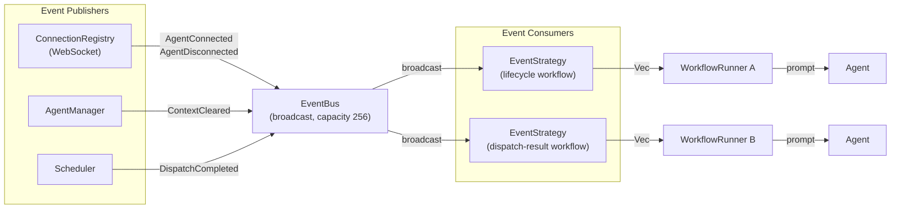

# Event-Driven Triggers

Event-driven triggers fire workflows in response to internal orchestrator events rather than on a schedule or by polling an external source. Two event trigger types are available as of Phase 3:

| Type | When it fires |
|------|--------------|
| `agent_lifecycle` | When a specific agent connects, disconnects, or clears its context |
| `dispatch_result` | When a workflow dispatch completes, enabling workflow chaining |

Both types are backed by the internal [Event Bus](#event-bus-architecture) and implemented via `EventStrategy`.

!!! note "API-only configuration"
    `agent_lifecycle` and `dispatch_result` triggers are created via the REST API directly (e.g. `curl`). The `agent orchestrator create-workflow` CLI and `.agentd/` YAML templates do not yet expose these trigger types.

---

## Event Bus Architecture

The orchestrator maintains a shared in-process event bus that connects internal components. All event-driven workflows subscribe to this bus through `EventStrategy`.



**Source code:** `crates/orchestrator/src/scheduler/events.rs`

### `SystemEvent` variants

| Variant | Published by | When |
|---------|-------------|------|
| `AgentConnected { agent_id }` | `ConnectionRegistry` | An agent establishes a WebSocket connection |
| `AgentDisconnected { agent_id }` | `ConnectionRegistry` | An agent's WebSocket connection is closed |
| `ContextCleared { agent_id }` | `AgentManager` | An agent's conversation context is cleared (`/clear`) |
| `DispatchCompleted { workflow_id, dispatch_id, status }` | `Scheduler` | A workflow dispatch finishes (success or failure) |

### Broadcast channel model

The bus uses `tokio::sync::broadcast` with a **capacity of 256**. Key behaviours:

- **Fan-out:** Every active `EventStrategy` subscriber receives every event.
- **Lag:** A subscriber that falls behind loses events older than the channel capacity. `EventStrategy` logs a warning and continues — it will not miss future events. See [Handling broadcast lag](#handling-broadcast-lag).
- **No persistence:** Events are not stored. A workflow that is not running when an event fires will not receive it.
- **No-op publish:** Publishing when no workflows are subscribed is safe and silent.

### Event ordering

Events are delivered to each subscriber in the order they were published. There are **no ordering guarantees** between different subscribers — two workflows may react to the same event at different times depending on their processing speed.

---

## `agent_lifecycle` Trigger

### Configuration format

```json
{
  "type": "agent_lifecycle",
  "event": "session_start"
}
```

**Field reference:**

| Field | Type | Required | Description |
|-------|------|----------|-------------|
| `type` | string | Yes | Must be `"agent_lifecycle"` |
| `event` | string | Yes | Lifecycle event to listen for (see table below) |

**Supported event values:**

| `event` value | Fires when | System event |
|--------------|-----------|-------------|
| `session_start` | The workflow's agent establishes a WebSocket connection | `AgentConnected` |
| `session_end` | The workflow's agent's WebSocket connection is closed | `AgentDisconnected` |
| `context_clear` | The workflow's agent's conversation context is cleared | `ContextCleared` |

The API validates `event` at creation time and returns `400 Invalid Input` for any other value.

### Agent ID matching

An `agent_lifecycle` workflow only fires for its **own assigned agent**. If multiple agents are running and one of them connects, only the workflow whose `agent_id` matches the connecting agent produces a task. Events for other agents are silently ignored.

This makes `agent_lifecycle` safe to use in multi-agent deployments — each workflow responds only to its own agent.

### Synthetic task structure

When the trigger fires, a synthetic `Task` is produced with these fields:

| Field | Value |
|-------|-------|
| `source_id` | `event:{event_type}:{agent_id}:{timestamp}` |
| `title` | `Agent lifecycle: {event_type}` |
| `body` | *(empty)* |
| `url` | *(empty)* |
| `labels` | *(empty)* |
| `assignee` | *(empty)* |

**Metadata map** (accessible as template variables):

| Key | Description | Example |
|-----|-------------|---------|
| `event_type` | The event name that fired | `session_start` |
| `agent_id` | UUID of the agent | `550e8400-...` |
| `timestamp` | RFC 3339 timestamp of the event | `2026-04-01T09:00:00Z` |

Because `source_id` includes both the agent UUID and the timestamp, each firing produces a unique identifier — the dedup check will never suppress a legitimate re-connection.

### Template variables

Use `{{event_type}}`, `{{agent_id}}`, and `{{timestamp}}` in prompt templates:

```
Agent {{agent_id}} fired a {{event_type}} event at {{timestamp}}.

Perform the necessary setup or cleanup tasks.
```

### Use cases

**Bootstrap on agent connect (`session_start`):**
Set up the agent's working environment, pull the latest code, or send an initial greeting every time the agent reconnects.

```json
{
  "name": "bootstrap-on-connect",
  "agent_id": "<AGENT_UUID>",
  "trigger_config": {
    "type": "agent_lifecycle",
    "event": "session_start"
  },
  "prompt_template": "Agent connected at {{timestamp}}. Pull latest changes and confirm the repo is clean.",
  "enabled": true
}
```

**Cleanup on agent disconnect (`session_end`):**
Log the disconnection, archive state, or notify a monitoring system when the agent goes offline.

**Re-initialise on context clear (`context_clear`):**
Re-inject important context after a `/clear` command resets the conversation history.

---

## `dispatch_result` Trigger

### Configuration format

```json
{
  "type": "dispatch_result",
  "source_workflow_id": "550e8400-e29b-41d4-a716-446655440001",
  "status": "completed"
}
```

**Field reference:**

| Field | Type | Required | Description |
|-------|------|----------|-------------|
| `type` | string | Yes | Must be `"dispatch_result"` |
| `source_workflow_id` | UUID string | No | Only match dispatches from this workflow. `null` or omitted = match any workflow |
| `status` | string | No | Only match dispatches with this status. `null` or omitted = match any status |

**Valid `status` values:** `pending`, `dispatched`, `completed`, `failed`, `skipped`

In practice, `dispatch_result` workflows are most useful filtering on `"completed"` or `"failed"`.

### Filtering behaviour

| `source_workflow_id` | `status` | Triggers when |
|---------------------|---------|---------------|
| set | set | That specific workflow completes with that specific status |
| set | `null` | That specific workflow completes with any status |
| `null` | set | Any workflow completes with that specific status |
| `null` | `null` | Any workflow dispatch completes |

### Synthetic task structure

| Field | Value |
|-------|-------|
| `source_id` | `event:dispatch:{dispatch_id}:{timestamp}` |
| `title` | `Dispatch completed: {dispatch_id} ({status})` |
| `body` | *(empty)* |
| `url` | *(empty)* |

**Metadata map:**

| Key | Description | Example |
|-----|-------------|---------|
| `source_workflow_id` | UUID of the workflow that completed | `550e8400-...` |
| `dispatch_id` | UUID of the specific dispatch record | `a1b2c3d4-...` |
| `status` | Completion status | `completed` |
| `timestamp` | RFC 3339 timestamp | `2026-04-01T09:05:00Z` |

`source_id` includes both the dispatch UUID and the timestamp, so it is unique per event.

### Workflow chaining

`dispatch_result` enables building multi-stage pipelines where each stage triggers the next:

```
Workflow A (lint)
    │ completes
    ▼
Workflow B (test) ← dispatch_result trigger, source=A, status=completed
    │ completes
    ▼
Workflow C (deploy) ← dispatch_result trigger, source=B, status=completed
```

Each downstream workflow uses `{{source_workflow_id}}` and `{{dispatch_id}}` in its prompt to reference upstream context.

### Template variables

```
Workflow {{source_workflow_id}} completed with status {{status}} at {{timestamp}}.
Dispatch ID: {{dispatch_id}}.

Run the next pipeline stage.
```

---

## Creating Event-Driven Workflows

Event-driven triggers are created via the orchestrator REST API. Use `curl` or any HTTP client.

### Create an `agent_lifecycle` workflow

```bash
curl -s -X POST http://127.0.0.1:17006/workflows \
  -H "Content-Type: application/json" \
  -d '{
    "name": "bootstrap-on-connect",
    "agent_id": "<AGENT_UUID>",
    "trigger_config": {
      "type": "agent_lifecycle",
      "event": "session_start"
    },
    "prompt_template": "Agent connected at {{timestamp}}. Pull latest changes and confirm the working tree is clean.",
    "enabled": true
  }'
```

### Create a `dispatch_result` workflow (chained pipeline)

**Step 1 — Create the upstream workflow (lint):**

```bash
curl -s -X POST http://127.0.0.1:17006/workflows \
  -H "Content-Type: application/json" \
  -d '{
    "name": "lint",
    "agent_id": "<LINT_AGENT_UUID>",
    "trigger_config": {
      "type": "github_issues",
      "owner": "myorg",
      "repo": "myrepo",
      "labels": ["run-pipeline"]
    },
    "prompt_template": "Run cargo clippy on the codebase. Report any warnings.",
    "enabled": true
  }'
# → note the workflow ID from the response: LINT_WF_ID
```

**Step 2 — Create the downstream workflow (test), triggered when lint completes:**

```bash
curl -s -X POST http://127.0.0.1:17006/workflows \
  -H "Content-Type: application/json" \
  -d '{
    "name": "test",
    "agent_id": "<TEST_AGENT_UUID>",
    "trigger_config": {
      "type": "dispatch_result",
      "source_workflow_id": "<LINT_WF_ID>",
      "status": "completed"
    },
    "prompt_template": "Lint (dispatch {{dispatch_id}}) completed at {{timestamp}}. Run cargo test and report results.",
    "enabled": true
  }'
# → note the workflow ID: TEST_WF_ID
```

**Step 3 — Create the deploy workflow, triggered when test completes:**

```bash
curl -s -X POST http://127.0.0.1:17006/workflows \
  -H "Content-Type: application/json" \
  -d '{
    "name": "deploy",
    "agent_id": "<DEPLOY_AGENT_UUID>",
    "trigger_config": {
      "type": "dispatch_result",
      "source_workflow_id": "<TEST_WF_ID>",
      "status": "completed"
    },
    "prompt_template": "Tests passed (dispatch {{dispatch_id}}). Deploy the release build.",
    "enabled": true
  }'
```

### Observe dispatch history

After the pipeline runs, inspect each workflow's dispatch history:

```bash
# List history for the lint workflow
curl -s http://127.0.0.1:17006/workflows/<LINT_WF_ID>/history | jq .

# Or via the CLI
agent orchestrator dispatch-history <LINT_WF_ID>
agent orchestrator dispatch-history <TEST_WF_ID>
agent orchestrator dispatch-history <DEPLOY_WF_ID>
```

---

## Operational Notes

### Handling broadcast lag

The event bus channel has a fixed capacity of **256 events**. If an `EventStrategy` subscriber falls behind (e.g. the agent is busy and dispatch is delayed), the channel may overflow and the subscriber will receive a `RecvError::Lagged` error.

When lag occurs:
- The `EventStrategy` logs a warning: `EventStrategy: subscriber lagged, some events may have been missed`
- The subscriber **resumes** from the oldest available event — it does **not** stop or crash
- Events that fell off the end of the channel are **permanently lost**

In a typical deployment (events fire at human timescales), the 256-event buffer is more than sufficient. High-frequency automation that fires hundreds of dispatches per second may need to reduce event-driven workflow complexity to avoid lag.

### Deduplication

Both event trigger types include a timestamp in `source_id`, making each firing unique:

- Lifecycle: `event:{event_type}:{agent_id}:{timestamp}` — unique per connect/disconnect
- Dispatch result: `event:dispatch:{dispatch_id}:{timestamp}` — unique per dispatch completion

The dedup check in the scheduler prevents re-dispatching the same event, which provides safety across orchestrator restarts if the same event happens to fire again quickly.

### No persistence

Events are not stored. If a workflow is disabled or its runner is not started when an event fires, the event is missed. Workflows should be created and enabled **before** the events they need to catch.

For `session_start` workflows, this means the workflow must be created and enabled before the agent connects. If the agent is already connected when the workflow is created, the `session_start` event has already fired and will not be re-delivered.

### Observing events in logs

The orchestrator logs an `info`-level message whenever it publishes each event type. Enable structured logging to correlate events with workflow dispatches:

```
INFO orchestrator::websocket agent_id=550e8400-... "Agent WebSocket registered"
INFO orchestrator::scheduler::runner workflow_id=... source_id=event:session_start:... "Dispatched task to agent"
```

For event lag warnings:

```
WARN orchestrator::scheduler::strategy lagged=3 "EventStrategy: subscriber lagged, some events may have been missed"
```

### Circular pipeline prevention

`dispatch_result` workflows can inadvertently create cycles if a downstream workflow's agent also completes a dispatch that is observed by an upstream filter. Design pipelines with unique agents or add `source_workflow_id` filters to ensure each stage only responds to its intended predecessor.
