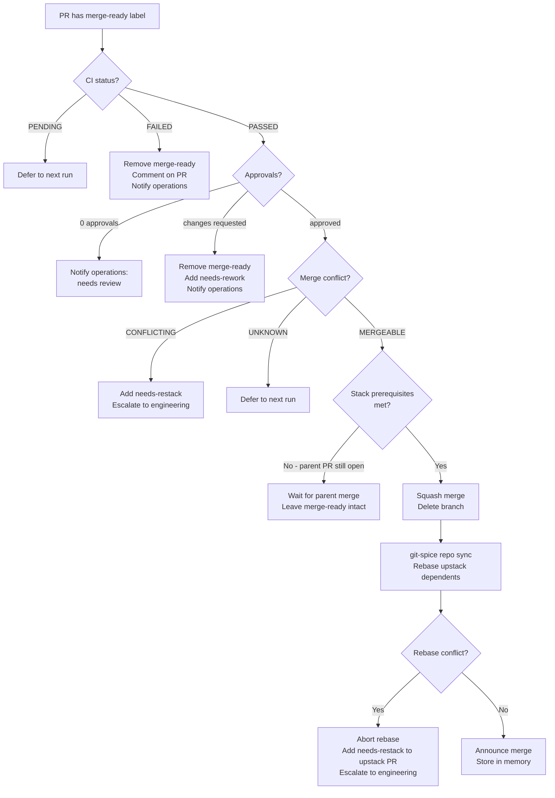

# Conductor Behavior

The conductor is the pipeline's central orchestrator. It runs on a 5-minute cron
(`conductor-sync` workflow) and is also dispatched directly when a PR receives the
`merge-ready` label (`merge-worker` workflow). It never modifies source code - its
tool policy blocks all writes to `crates/`, `ui/`, `docs/`, and `.agentd/`.

## Sync Protocol

Each cron run executes these steps in order. The conductor stops on the first
unrecoverable error (rebase conflict, gate block) and escalates to engineering.

### Step 1 - Sync repository state

```bash
git-spice repo sync   # detect merged PRs, clean branches, rebase dependents
git-spice log short   # log current stack state
```

If `git-spice repo sync` exits with a rebase conflict, the conductor aborts the
rebase, identifies the conflicting branch, adds `needs-restack` to the affected PR,
and posts to `#engineering` before stopping. See [Restack conflicts](troubleshooting.md#restack-conflict).

### Step 2 - Triage unlabeled issues

Find open issues with no labels and apply `needs-triage` so the `triage-worker`
workflow picks them up:

```bash
gh issue list --repo geoffjay/agentd --state open \
  --json number,title,labels \
  --jq '[.[] | select(.labels | length == 0)]'

gh issue edit <number> --repo geoffjay/agentd --add-label "needs-triage"
```

### Step 3 - Dispatch triaged issues

Find issues with `triaged` that have no agent dispatch label and apply `agent`:

```bash
gh issue list --repo geoffjay/agentd --label triaged --state open \
  --json number,title,labels \
  --jq '[.[] | select(
    ([.labels[] | select(.name | IN(
      "agent","plan-agent","docs-agent",
      "enrich-agent","test-agent","refactor-agent",
      "research-agent","security-agent"
    ))] | length == 0)
  )]'
```

The conductor only dispatches issues that are well-scoped. Issues with
`complexity:large` are held unless they also have a `plan` label indicating they
have been broken down into sub-issues.

### Step 4 - Nudge stalled reviews

Find PRs with `review-agent` that have no reviewer activity after 30 minutes and
post a nudge to `#engineering`. The conductor checks shared memory before nudging
to avoid repeat messages within the same hour.

### Step 5 - Promote approved PRs

Find approved PRs that lack `merge-ready`, `needs-rework`, and `needs-restack` and
apply `merge-ready`:

```bash
gh pr edit <number> --repo geoffjay/agentd --add-label "merge-ready"
```

The `review-merge-chain` workflow can automate this promotion when enabled - see
[Workflow chaining](#workflow-chaining).

### Step 6 - Merge eligible PRs

Process `merge-ready` PRs in stack order (bottom of stack first) using the full
merge flow. See [Merge queue](#merge-queue) below.

### Step 7 - Re-dispatch needs-rework

Find PRs with `needs-rework` that have been waiting >15 minutes, find the linked
issue, remove `needs-rework` from the PR, and re-apply `agent` to the issue:

```bash
gh pr edit <pr-number> --repo geoffjay/agentd --remove-label "needs-rework"
gh issue edit <issue-number> --repo geoffjay/agentd --add-label "agent"
```

### Step 8 - Detect stale items

Flag issues and PRs with no activity for >3 days and post to `#operations`:

```bash
# Stale open PRs
gh pr list --repo geoffjay/agentd --state open \
  --json number,title,updatedAt,labels \
  --jq '[.[] | select((.updatedAt | fromdateiso8601) < (now - 259200))]'
```

The conductor checks memory before posting to avoid repeated stale alerts for the
same item.

### Step 9 - Post status digest

If any state transitions occurred, post a digest to `#operations`:

```
📊 Pipeline sync 14:35 UTC:
• Needs triage:    2 issue(s)
• Merge queue:     1 PR(s) ready
• In review:       3 PR(s) awaiting reviewer
• Needs rework:    1 PR(s) with requested changes
• Active branches: 7
• Transitions this run: triaged #682, merged PR #700
```

### Step 10 - Store run state in memory

```bash
agent memory remember "Conductor sync at <timestamp>. \
  Transitions: <what changed>. Pipeline health: <ok|degraded|blocked>." \
  --created-by conductor --type information \
  --tags conductor,pipeline --visibility public
```

---

## Merge Queue

The `merge-worker` workflow triggers the conductor for each `merge-ready` PR. The
conductor verifies all criteria before performing the squash merge.

### Merge criteria

A PR is eligible to merge when **all** of the following are true:

1. Has the `merge-ready` label
2. At least one approving review; zero change requests (per reviewer's latest review)
3. All CI checks are `SUCCESS` or `SKIPPED` - no `FAILURE`, `ERROR`, or `PENDING`
4. GitHub reports `MERGEABLE` (no conflict with base)
5. No `needs-restack` or `needs-rework` label present
6. All PRs below it in the stack are already merged

### Stack order

Merges always happen bottom-of-stack first. A PR is at the bottom when its base
branch is `main`, `feature/autonomous-pipeline`, or a branch already deleted after
merging.

```bash
# Authoritative stack order
git-spice log long --json

# Quick visual
git-spice log short
```

### The merge flow (8 steps)



### Handling CI failure mid-queue

When CI fails on a `merge-ready` PR:

```bash
# Remove merge-ready so it doesn't block the queue
gh pr edit <number> --repo geoffjay/agentd --remove-label "merge-ready"

# Comment on the PR
gh pr comment <number> --repo geoffjay/agentd \
  --body "❌ CI check '<name>' failed. Removing merge-ready. Re-apply after CI is green."

# Notify operations
agent communicate message send operations \
  "❌ PR #<number> removed from merge queue: CI check '<name>' failed."
```

---

## Escalation Rules

The conductor posts to `#engineering` (not `#operations`) when human intervention
is required. It never attempts to resolve these situations autonomously.

| Condition | Escalation channel | Trigger |
|-----------|-------------------|---------|
| Rebase conflict after sync | `#engineering` | `git-spice repo sync` non-zero exit |
| Rebase conflict after merge | `#engineering` | Upstack rebase fails post-merge |
| CI failing >24 hours on a merge-ready PR | `#engineering` | Stale work detection |
| PR in `needs-rework` >3 days without activity | `#engineering` | Stale work detection |
| Merge queue fully blocked | `#engineering` | No PR can merge |
| Agent dispatched but no PR after >6 hours | `#engineering` | Stale work detection |
| Human approval gate triggered | `#engineering` | Always |
| RUSTSEC advisory detected | `#engineering` + @geoff mention | Security agent alert |
| Conflict affects `main` or pipeline base branch | `#engineering` + @geoff mention | Conflict escalation |
| >5 stale items simultaneously | `#engineering` + @geoff mention | Stale detection |

Escalation message format:

```bash
agent communicate message send engineering \
  "⛔ Gate blocked: <operation> requires human approval.
   PR/Issue: #<number>
   Reason: <why the gate fired>
   Action required: <what human must do to unblock>"
```

---

## Workflow Chaining

Two workflows use the `dispatch_result` trigger to automatically advance the pipeline
without requiring a human to apply the next label.

### How `dispatch_result` works

When any workflow dispatch completes (status: `completed`), the orchestrator fires
a `dispatch_result` event. Workflows sourced on `dispatch_result` receive:

| Variable | Description |
|----------|-------------|
| `{{source_workflow_id}}` | UUID of the workflow that just completed |
| `{{dispatch_id}}` | UUID of the completed dispatch record |
| `{{status}}` | `completed` or `failed` |
| `{{timestamp}}` | RFC 3339 completion time |
| `{{original_source_id}}` | Issue/PR number from the parent dispatch |

### triage-enrich-chain

When `triage-worker` completes, this chain applies `enrich-agent` to the issue,
automatically advancing it to the enrichment stage:

```
triage-worker dispatch completes
  → triage-enrich-chain fires
    → conductor verifies issue still needs enrichment
      → applies enrich-agent label
        → enrichment-worker picks up issue
```

**Setup** (required before enabling):

```bash
# 1. Find the triage-worker workflow UUID after deployment
TRIAGE_ID=$(agent orchestrator list-workflows --json | \
  jq -r '.[] | select(.name=="triage-worker") | .id')

# 2. Find this chain workflow's UUID
CHAIN_ID=$(agent orchestrator list-workflows --json | \
  jq -r '.[] | select(.name=="triage-enrich-chain") | .id')

# 3. Scope to triage-worker only (prevents firing on every dispatch)
curl -s -X PATCH http://127.0.0.1:17006/workflows/$CHAIN_ID \
  -H "Content-Type: application/json" \
  -d "{\"source\": {\"source_workflow_id\": \"$TRIAGE_ID\"}}"

# 4. Enable
curl -s -X PATCH http://127.0.0.1:17006/workflows/$CHAIN_ID \
  -H "Content-Type: application/json" \
  -d '{"enabled": true}'
```

!!! warning "Enable only after setting `source_workflow_id`"
    Without the scope filter, `triage-enrich-chain` fires on **every** dispatch
    completion in the system - including its own - creating an infinite loop that
    repeatedly re-applies `enrich-agent`. Always complete the setup steps above
    before enabling.

### review-merge-chain

When `pull-request-reviewer` completes, this chain checks whether the PR is
merge-ready and applies `merge-ready` if all criteria are met:

```
pull-request-reviewer dispatch completes
  → review-merge-chain fires
    → conductor checks PR: approved? CI green? no blockers?
      → if ready: applies merge-ready
        → merge-worker picks up PR
```

Setup is identical: find the `pull-request-reviewer` UUID, patch `source_workflow_id`
into `review-merge-chain`, then enable.

### Agent coordination lock

When the conductor performs bulk pipeline mutations (closing or editing >3 issues),
it acquires a coordination lock:

```bash
# Acquire lock before bulk changes
agent communicate message send engineering \
  "[LOCK] conductor: pipeline sync in progress -- hold all issue creation"

# ... perform mutations ...

# Release lock
agent communicate message send engineering \
  "[UNLOCK] conductor: pipeline sync complete"
```

The `.claude/hooks/check-coordination.py` PreToolUse hook blocks `gh issue create`
and `gh issue close` while an active `[LOCK]` from any agent is in the engineering room.
The conductor must honour locks set by other agents and delay its sync if one is active.

---

## Manual Trigger

Trigger a conductor sync immediately without waiting for the 5-minute cron:

```bash
gh issue edit <any-issue-number> --repo geoffjay/agentd --add-label "conductor-sync"
```

The `conductor-sync-manual` workflow polls for this label and dispatches the conductor.
The conductor removes the label when done.

---

## Related

- [Pipeline Overview](index.md) - Architecture diagram and agent roster
- [State Machine](../pipeline-state-machine.md) - Full label reference
- [Human Approval Gates](../../planning/autonomous-pipeline-gates.md) - Gate reference
- [Troubleshooting](troubleshooting.md) - Common failure modes
- `.agentd/agents/conductor.yml` - Conductor system prompt (authoritative)
- `.agentd/workflows/conductor-sync.yml` - Cron sync workflow
- `.agentd/workflows/merge-worker.yml` - Label-triggered merge workflow
