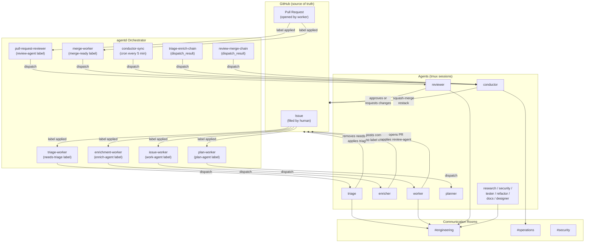

# Autonomous Pipeline Architecture

The agentd autonomous pipeline is a label-driven system where GitHub labels trigger
specialized agents at each stage of an issue's lifecycle. A central conductor agent
runs on a 5-minute cron to drive state transitions, manage the merge queue, and
escalate anything it cannot resolve automatically.

## End-to-End Architecture

## Pipeline Stages

An issue moves through these stages in order. Stages marked **optional** are
skipped for well-understood issues.

| Stage | Entry condition | Exit condition | Agent |
|-------|----------------|----------------|-------|
| **Triage** | `needs-triage` applied | `triaged` applied | triage |
| **Enrich** *(optional)* | `enrich-agent` applied | label removed | enricher |
| **Research** *(optional)* | `research-agent` applied | label removed | research |
| **Plan** *(optional)* | `plan-agent` applied | label removed | planner |
| **Implement** | `work-agent` applied | PR opened + `review-agent` | worker |
| **Review** | `review-agent` applied to PR | `merge-ready` or `needs-rework` | reviewer |
| **Merge** | `merge-ready` applied to PR | PR merged, issue closed | conductor |
| **Document** *(optional)* | `docs-agent` applied post-merge | label removed | documenter |

The conductor's 5-minute cron drives transitions that agents don't trigger directly:
applying `needs-triage` to unlabeled issues, promoting `triaged` issues to `work-agent`,
promoting approved PRs to `merge-ready`, and re-dispatching `needs-rework` PRs.

## Agent Roster

=== "Core pipeline agents"

    | Agent | Trigger | Scope | Rooms |
    |-------|---------|-------|-------|
    | **conductor** | `conductor-sync` cron (5 min) + `merge-ready` on PRs | Pipeline orchestration, merge queue, escalation | engineering, operations (admin), announcements |
    | **triage** | `needs-triage` on issues | Label assignment, duplicate detection, complexity estimation | engineering, announcements |
    | **enricher** | `enrich-agent` on issues | Adds acceptance criteria, file paths, test cases to issues | engineering, announcements |
    | **planner** | `plan-agent` on issues | Breaks epics into sub-issues with dependencies | engineering, announcements |
    | **worker** | `work-agent` on issues | Implements issues — code, tests, branch, PR | engineering, announcements |
    | **reviewer** | `review-agent` on PRs | Code review — correctness, safety, style, scope | engineering, announcements |
    | **documenter** | `docs-agent` on issues/PRs | Writes and updates documentation | engineering, announcements |

=== "Specialist agents"

    | Agent | Trigger | Scope | Rooms |
    |-------|---------|-------|-------|
    | **research** | `research-agent` on issues | Investigates technologies, protocols, feasibility | engineering, announcements |
    | **security** | `security-agent` on issues/PRs + weekly cron | Dependency audits, secret scanning, anti-pattern detection | engineering, security (admin), announcements |
    | **tester** | `test-agent` on issues/PRs | Writes unit and integration tests; may not modify production code | engineering, announcements |
    | **refactor** | `refactor-agent` on issues/PRs | Code structure improvements without behavior changes | engineering, announcements |
    | **architect** | `architecture` label on PRs | Cross-service design review, ADR authoring | engineering, announcements |
    | **designer** | `design-agent` on issues | UI/UX design, component specifications | engineering, announcements |

=== "Tool policies by agent"

    | Agent | Policy | Rationale |
    |-------|--------|-----------|
    | conductor | deny_list — cannot write to `crates/`, `ui/`, `docs/`, `.agentd/` | Pipeline-only agent; no source modification |
    | triage | allow_all | Needs to read codebase and post GitHub comments |
    | worker | deny_list — blocks `.agentd/agents/*`, orchestrator core, force push | Implementation agent; guards human-gate operations |
    | reviewer | allow_all | Needs full read access for thorough review |
    | tester | allow_list — read + write only to `crates/*/tests/` and `.github/workflows/` | Hard scope: test files only, never production code |
    | security | deny_list — cannot write to `crates/`, `ui/`, `.agentd/`, `docs/` | Detection and reporting only; no code modification |
    | research | allow_all | Investigation needs broad read access |

## Workflow Chaining

Two workflows use the `dispatch_result` trigger to automatically advance the pipeline
when an upstream dispatch completes:

**`triage-enrich-chain`** — When `triage-worker` completes successfully, the conductor
applies `enrich-agent` to the issue, causing `enrichment-worker` to pick it up next.

**`review-merge-chain`** — When `pull-request-reviewer` completes successfully, the
conductor checks whether the PR meets merge criteria and applies `merge-ready` if it does.

Both chain workflows ship with `enabled: false` and require `source_workflow_id` to be
set before enabling. See [Workflow Chaining](conductor.md#workflow-chaining) for setup
instructions.

## Label Summary

| Color family | Purpose | Examples |
|---|---|---|
| Blue | Pipeline states | `needs-triage`, `triaged`, `merge-ready`, `merge-queue` |
| Amber/yellow | Warnings | `needs-rework`, `needs-restack`, `needs-refinement` |
| Green | Agent dispatch | `work-agent`, `review-agent`, `enrich-agent`, `test-agent` |
| Indigo/orange | Specialist dispatch | `research-agent`, `security-agent`, `conductor-sync` |
| Red | Blocking | `needs-rework` (blocks merge), `needs-triage` |

Full label reference: [State Machine](../pipeline-state-machine.md)

## Related

- [State Machine](../pipeline-state-machine.md) — Full label reference and lifecycle diagram
- [Conductor Behavior](conductor.md) — Sync protocol, merge queue, escalation
- [Troubleshooting](troubleshooting.md) — Common failure modes
- [Human Approval Gates](../../planning/autonomous-pipeline-gates.md) — What requires human input
- [Agent Onboarding](../agents/onboarding.md) — How to create new agents and workflows
